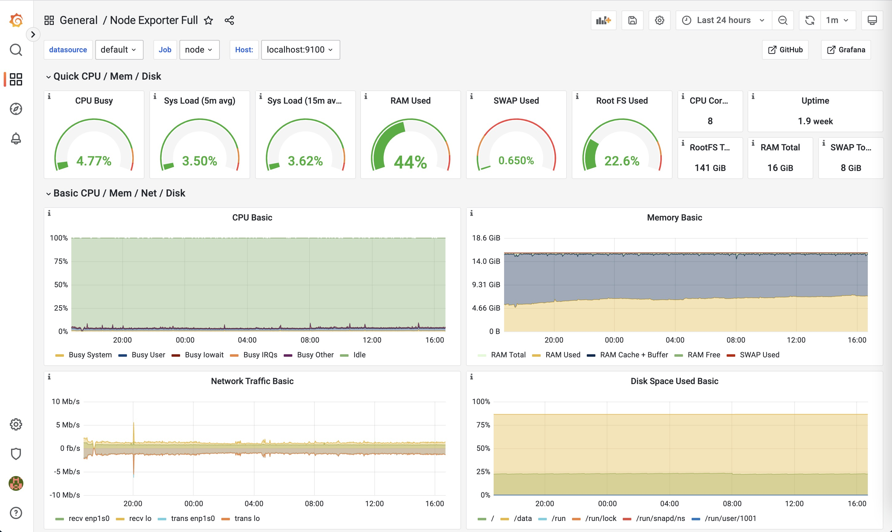
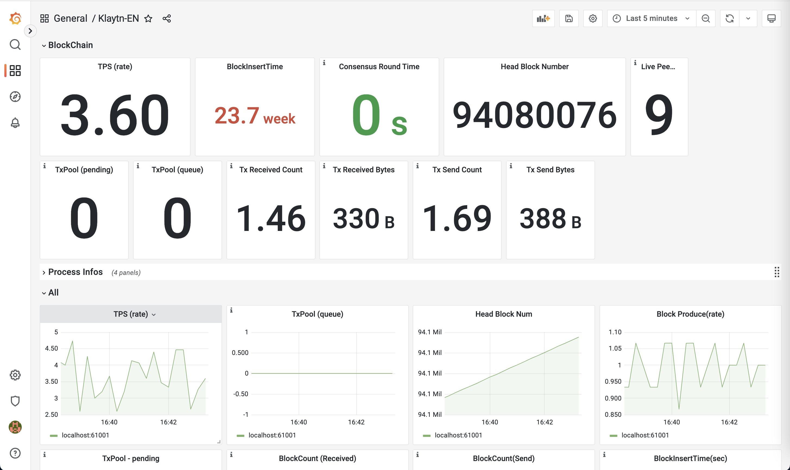
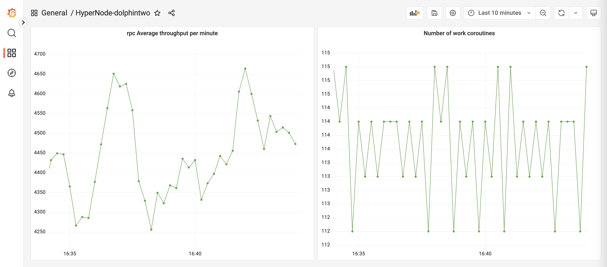

# HyperNode Monitor

> Author: dolphintwo

## depends_on

- [prometheus](https://prometheus.io/download/#prometheus)
- [grafana](https://grafana.com/grafana/download/9.0.1?pg=get&plcmt=selfmanaged-box1-cta1&edition=oss)
- [node_exporter](https://prometheus.io/download/#node_exporter)
- [alertmanager](https://prometheus.io/download/#alertmanager)

`service file demo` is in [`example_files/service`](./example_files/service/)

## Settings

### klaytn

> enable metrics on `:61001` and restart kend

```ini
# /usr/local/conf/kend.conf

METRICS=1
PROMETHEUS=1
```

### Hypernode

> metrics is open on `:8899`

### prometheus

```yaml
scrape_configs:
  - job_name: "node"
    static_configs:
      - targets: ['localhost:9100']

  - job_name: "hypernode"
    static_configs:
      - targets: ['localhost:8899']

  - job_name: "klaytn_en"
    static_configs:
      - targets: ['localhost:61001']
```

### grafana

- 1. node_metrics, dashboard file is [example_files/grafana/node.json](example_files/grafana/node.json)



- 2. klaytn_metrics, dashboard file is [example_files/grafana/klaytn-en.json](example_files/grafana/klaytn-en.json)



- 3. hypernode_metrics, dashboard file is [example_files/grafana/hypernode.json](example_files/grafana/hypernode.json)



## TODO

- Alertmanager

## Thanks

- [Official Document](https://testnet-docs.blockpi.io/guide-for-operators/testnet-1/monitoring)
